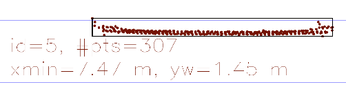

# Final Project WriteUp

## FP.1 Match 3D Objects

Implement the method "matchBoundingBoxes", which takes as input both the previous and the current data frames and provides as output the ids of the matched regions of interest (i.e. the boxID property). Matches must be the ones with the highest number of keypoint correspondences.

Implementation is in `matchBoundingBoxes` function (`camFusion_Student.cpp`)

Approach: To find the best matches bounding boxes between the current frame and the previous frame, first we count the number of matched keypoints for each pair of bounding boxes and store them in vectors. Then, we can start picking up associated bounding boxes starting from the pair with the highest number of keypoints matches. To filter out outliers, here we set a minimum requirement size of keypoint matches between the associated bounding boxes and make sure the associated bounding boxes have the same classID estimated by YOLO object detection. By repeating the above-mentioned step, the best bounding box matches can be obtained.

## FP.2 Compute Lidar-based TTC

Compute the time-to-collision in second for all matched 3D objects using only Lidar measurements from the matched bounding boxes between current and previous frame.

Implementation is in `computeTTCLidar` function (`camFusion_Student.cpp`)

Approach: First we only pick up the Lidar points within ego lane, then calculate the mean and standard deviation of Lidar points to filter out outliers. Since only finding the closest points in the current frame and the previous frame may cause unreasonable TTC estimation sometimes as there may exist outliers in the detected bounding box. In addition, those closest points are not actually associated pairs like we detect keypoint matches using camera. Hence, we average qualified Lidar points in the current frame and the previous frame for Lidar TTC estimation.

## FP.3 Associate Keypoint Correspondences with Bounding Boxes

Prepare the TTC computation based on camera measurements by associating keypoint correspondences to the bounding boxes which enclose them. All matches which satisfy this condition must be added to a vector in the respective bounding box.

Implementation is in `clusterKptMatchesWithROI` function (`camFusion_Student.cpp`)

Approach: First we iteratively go through each keypoint match and check whether the corresponding keypoints are in the region of the bounding box. Next, to filter out outliers, we calculate the mean of feature distance among all matched keypoints and only consider those matched keypoints whose feature distance are less than the mean. Finally, we save the qualified keypoint pairs into the bounding box.

## FP.4 Compute Camera-based TTC

Compute the time-to-collision in second for all matched 3D objects using only keypoint correspondences from the matched bounding boxes between current and previous frame.

Implementation is in `computeTTCCamera` function (`camFusion_Student.cpp`)

Approach: Like we did in the exercise, we calculate distance ratios between matched keypoints obtained from task 3. Then we pick up the median of all distance ratios for more accurate camera TTC estimation.

## FP.5 Performance Evaluation 1

Find examples where the TTC estimate of the Lidar sensor does not seem plausible. Describe your observations and provide a sound argumentation why you think this happened.

As mentioned in `FP.3` part, if we only search the closest point from Lidar point cloud, erroneous TTC estimations may occur. Outliers/wrong measurements for Lidar points may be included in the bounding box.

For example, the image (KITTI data set) shown below may have outliers included (points deviated from the uniformly distributed point cloud when measuring the backside of a car).

## FP.6 Performance Evaluation 2

Run several detector / descriptor combinations and look at the differences in TTC estimation. Find out which methods perform best and also include several examples where camera-based TTC estimation is way off. As with Lidar, describe your observations again and also look into potential reasons.

Below are the experiment results we ran using different detector/descriptor combinations based on 2D feature tracking project:

For Lidar-based TTC(s):

| Image_1 | Image_2 | Image_3 | Image_4 | Image_5 | Image_6 | Image_7 | Image_8 | Image_9 | Image_10 | 
|:-------:|:-------:|:-------:|:-------:|:-------:|:-------:|:-------:|:-------:|:-------:|:--------:|
| 12.69   | 12.85   | 18.25   | 15.31   | 12.07   | 12.64   | 12.71   | 13.76   | 13.13   | 12.73    |

For Camera-based TTC(s):

| Detector  | Descriptor | Image_1 | Image_2 | Image_3 | Image_4 | Image_5 | Image_6 | Image_7 | Image_8 | Image_9 | Image_10 |
|-----------|:----------:|:-------:|:-------:|:-------:|:-------:|:-------:|:-------:|:-------:|:-------:|:-------:|:--------:|
| FAST      | BRIEF      | 9.96    | 12.77   | 15.72   | 23.38   | 13.64   | 12.51   | 10.97   | 11.13   | 12.83   | 12.1     |
| FAST      | BRISK      | 11.45   | 12.59   | 14.82   | 12.68   | 12.82   | 12.59   | 11.61   | 11.3    | 11.71   | 11.37    |
| FAST      | ORB        | 10.71   | 12.24   | 13.93   | 12.09   | 12.45   | 12.55   | 11.49   | 11.97   | 14.15   | 12.93    |
| SHITOMASI | BRISK      | 13.24   | 13.03   | 13.12   | 12.53   | 12.56   | 12.99   | 13.04   | 11.68   | 12.11   | 11.22    |
| AKAZE     | AKAZE      | 12.34   | 13.59   | 13.30   | 13.30   | 15.53   | 13.35   | 15.62   | 14.07   | 13.91   | 11.61    |
| SIFT      | SIFT       | 10.42   | 13.56   | 12.91   | 15.01   | 12.46   | 11.81   | 13.86   | 14.69   | 12.96   | 10.93    |
| BRISK     | FREAK      | 11.33   | 29.06   | 10.93   | 14.34   | 25.33   | 11.84   | 9.78    | 12.89   | 16.95   | 11.25    |
| HARRIS    | BRIEF      | 8.81    | -0.1    | nan     | -0.2    | 13.27   | 13.55   | 12.2    | -0.2    | nan     | -0.2     |
| ORB       | ORB        | 12.45   | -inf    | 11.01   | -inf    | 27.78   | -inf    | 9.15    | nan     | -inf    | 23.97    |

Differences in TTC estimations(s):

| Detector  | Descriptor | Image_1 | Image_2 | Image_3 | Image_4 | Image_5 | Image_6 | Image_7 | Image_8 | Image_9 | Image_10 |
|-----------|:----------:|:-------:|:-------:|:-------:|:-------:|:-------:|:-------:|:-------:|:-------:|:-------:|:--------:|
| FAST      | BRIEF      | 2.73    | 0.08    | 2.53    | 8.07    | 1.57    | 0.13    | 1.74    | 2.63    | 0.3     | 0.63     |
| FAST      | BRISK      | 1.24    | 0.26    | 3.43    | 2.63    | 0.75    | 0.05    | 1.1     | 2.46    | 1.42    | 1.36     |
| FAST      | ORB        | 1.98    | 0.61    | 4.32    | 3.22    | 0.38    | 0.09    | 1.22    | 1.79    | 1.02    | 0.2      |
| SHITOMASI | BRISK      | 0.55    | 0.18    | 5.13    | 2.78    | 0.49    | 0.35    | 0.33    | 2.08    | 1.02    | 1.51     |
| AKAZE     | AKAZE      | 0.35    | 0.74    | 4.95    | 2.01    | 3.46    | 0.71    | 2.91    | 0.31    | 0.78    | 1.12     |
| SIFT      | SIFT       | 2.27    | 0.71    | 5.34    | 0.3     | 0.39    | 0.83    | 1.15    | 0.93    | 0.17    | 1.8      |
| BRISK     | FREAK      | 1.36    | 16.21   | 7.32    | 0.97    | 13.26   | 0.8     | 2.93    | 0.87    | 3.82    | 1.43     |
| HARRIS    | BRIEF      | 3.88    | 12.95   | nan     | 15.1    | 1.2     | 0.91    | 0.51    | 13.96   | nan     | 12.93    |
| ORB       | ORB        | 0.24    | -inf    | 7.24    | -inf    | 15.71   | -inf    | 3.56    | nan     | -inf    | 11.24    |

As shown in the table above, detector/descriptor combinations `FAST/BRISK`, `FAST/ORB`, `SHITOMASI/BRISK` and `SIFT/SIFT` got the smaller TTC difference comparing to other methods, whereas `HARRIS/BRIEF` and `ORB/ORB` got the worst performance. The reason might be these two combinations got very few matched keypoints in the bounding box, resulting in unreliable Camera TTC estimation.
