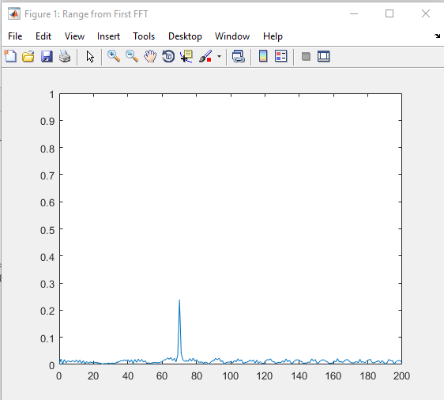
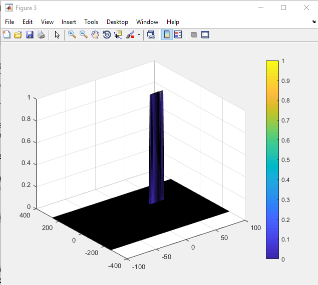

# Radar Target Generation and Detection

## Project Writeup

### FMCW Waveform Design

Given speed of light = 3*10^8, max range = 200m and range resolution = 1m, the Bandwidth (B), Chirp Time (Tchirp) and Slope (slope) of the FMCW chirp can be calculated.  
The Slope is 2.0455e+13, which is obtained by B/Tchirp.

### Simulation Loop

The target movement is simulated and the beat or mixed signal for every timestamp is calculated.  
A beat signal is generated within an error margin of +/- 10 meters in range FFT.

### Range FFT (1st FFT)

The initial position of the target is 70m, and a peak is generated within the given margin.

### 2D CFAR Implementation

To detect the target, we create a window and slide it through the Range Doppler Map.  
First we define the number of training cells and guard cells for range dimension (Tr=10, Gr=4) and
doppler dimension (Td=8, Gd=4), respectively.  
And we also set up the Offset parameter (offset=10) that is used to offset the threshold by SNR value in dB.

Given Nr=1024 and Nd=128, as we only need one side of signal, we slide the defined window through
512x128.  
Then we sum up the single (convert from decibels to power) in training cells and take the average of it,
and we convert it back to decibels and add the Offset value to it to determine the threshold.

Now we compare the signal under CUT with the threshold value. If the signal under CUT is greater than
the threshold, we assign value 1 to it, otherwise we assign value 0 to it.  
Since CUTs cannot be located at the edges of the matrix, we need to assign value 0 to them.
We simply create a double for loop and check if CUTs position is at the edge.  
Finally, we use surf function to plot the output of 2D CFAR.

