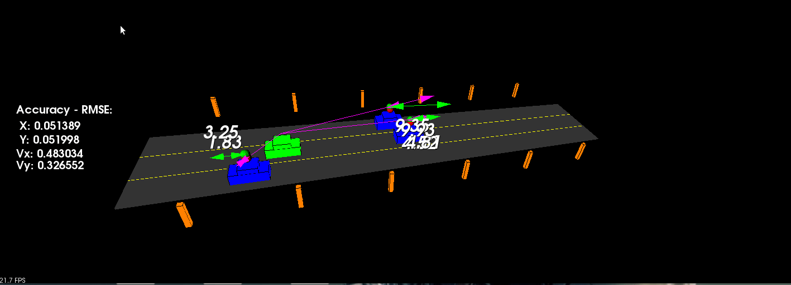

# Unscented Kalman Filter

In this project we will implement an Unscented Kalman Filter to estimate the state of multiple cars on a highway using noisy lidar and radar measurements.

`main.cpp` is using `highway.h` to create a straight 3 lane highway environment with 3 traffic cars and the main ego car at the center. 
The viewer scene is centered around the ego car and the coordinate system is relative to the ego car as well. The ego car is green while the 
other traffic cars are blue. The traffic cars will be accelerating and altering their steering to change lanes. Each of the traffic car's has
it's own UKF object generated for it, and will update each individual one during every time step. 

The red spheres above cars represent the (x,y) lidar detection and the purple lines show the radar measurements with the velocity magnitude along the detected angle. The Z axis is not taken into account for tracking, so we are only tracking along the X/Y axis.

---

## Other Important Dependencies

* cmake >= 3.5
  * All OSes: [click here for installation instructions](https://cmake.org/install/)
* make >= 4.1 (Linux, Mac), 3.81 (Windows)
  * Linux: make is installed by default on most Linux distros
  * Mac: [install Xcode command line tools to get make](https://developer.apple.com/xcode/features/)
  * Windows: [Click here for installation instructions](http://gnuwin32.sourceforge.net/packages/make.htm)
* gcc/g++ >= 5.4
  * Linux: gcc / g++ is installed by default on most Linux distros
  * Mac: same deal as make - [install Xcode command line tools](https://developer.apple.com/xcode/features/)
  * Windows: recommend using [MinGW](http://www.mingw.org/)
* PCL >= 1.2
  * Download PCL [here](https://pointclouds.org/downloads/)

## Basic Build Instructions

1. Clone this repo: `git clone https://github.com/PoChang007/Sensor_Fusion_Nanodegree.git`
2. `cd Sensor_Fusion_Nanodegree/Project_5_Unscented_Kalman_Filter`
3. `mkdir build && cd build`
4. Compile: `cmake .. && make`
5. Run it: `./ukf_highway`

## Simulation Result (Accuracy Verification)

The RMSEs of predicted location and velocity (px, py, vx, and vy) compared to ground truth data are less than [0.30, 0.16, 0.95, 0.70] in the whole simulation process.

