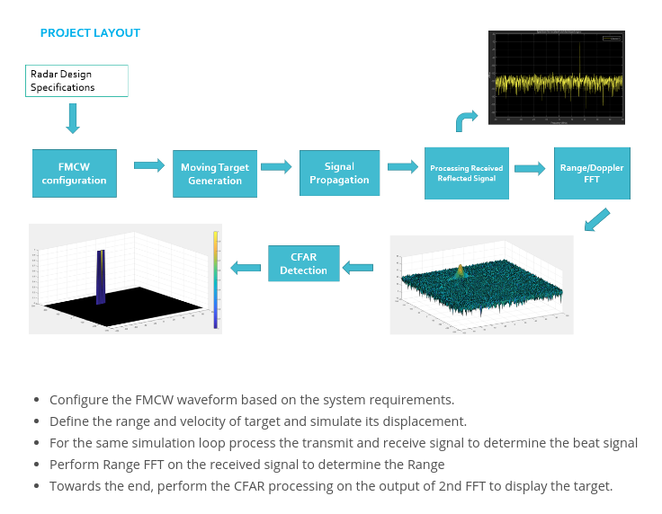

# Udacity - Sensor Fusion Nanodegree Program

I took this program in 2021. It was a fantastic experience learning how to process data from different types of sensors and apply it to autonomous driving. 

Below are the projects I worked on in this program:

## Project 1 - Lidar Obstacle Detection

## Project 2 - 2D Feature Tracking

## Project 3 - 3D Object Tracking

## Project 4 - Radar

## Project 5 - Unscented Kalman Filter

